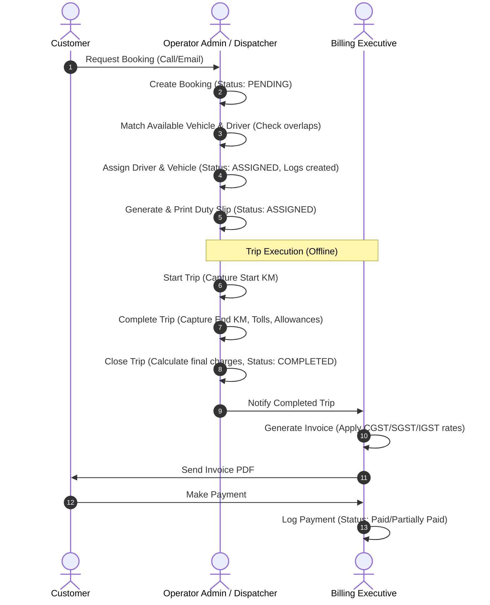

# Product Requirement Document (PRD)
## Cab Billing & Fleet Management SaaS MVP
**Document Version:** 1.0.0  
**Date:** June 12, 2026  
**Target Audience:** Engineering Team, QA Team, Project Stakeholders  

---

## 1. Executive Summary & Product Scope

### 1.1 Objective
The Cab Billing & Fleet Management SaaS platform is a multi-tenant web application designed for cab operators and travel agencies. It aims to replace error-prone spreadsheets, disjointed WhatsApp messaging, and manual billing calculations with a centralized administrative system. This product focuses entirely on B2B/admin operations (Operator portal), optimizing workflows from booking intake to vehicle dispatch, duty slip generation, trip closure, invoicing, and payment collection.

### 1.2 Out of Scope (Strict Exclusions)
To maintain MVP focus, the following features are **explicitly excluded** from this phase:
- Driver Mobile Application (All driver communication is handled externally via SMS/WhatsApp; admin logs details).
- Customer Mobile Application (Customers interact via email, phone, or corporate booking requests logged by the operator).
- GPS / Real-time Vehicle Tracking.
- Route Optimization Algorithms.
- Live Map Tracking.
- AI-based Demand Forecasting or Dynamic Pricing.

---

## 2. Business Workflows & System Architecture

### 2.1 Multi-Tenant SaaS Isolation Model
The application operates on a shared-database, logical-isolation model. 
- **Tenant (Company)**: Represented by a record in the `tenants` table. Every administrative user, customer, driver, vehicle, booking, and invoice belongs to a specific `tenant_id`.
- **Global Context**: Super Admins (SaaS Owners) can view all tenants. Operator Admins, Dispatchers, and Billing Executives are sandboxed to their respective `tenant_id` and cannot access data belonging to other companies.

### 2.2 System Process Workflow
The system represents a linear operational pipeline:



---

## 3. Detailed MVP Module Specifications

### 3.1 Dashboard Module
Provides a high-level operational and financial pulse of the organization.
- **Widgets & Metrics**:
  - **Today's Bookings**: Count of bookings scheduled for today.
  - **Active Trips**: Count of trips with booking status = `STARTED` or duty slips with status = `FILLED`.
  - **Completed Trips**: Count of trips completed today.
  - **Pending Invoices**: Total count and value of invoices in `SENT` or `UNPAID` status.
  - **Revenue**: Monthly accumulated revenue (Sum of all completed trip amounts).
  - **Outstanding Payments**: Sum of `due_amount` across all unpaid/partially paid invoices.
  - **Available Vehicles**: Count of vehicles in `AVAILABLE` status.
  - **Available Drivers**: Count of drivers in `AVAILABLE` status.
- **SaaS Behavior**: Automatically filtered by the logged-in user's `tenant_id`.

### 3.2 Customer Management
Enables the administration of clients, corporate entities, and custom pricing contracts.
- **Features**:
  - Add / Edit Customer profiles.
  - Customer categorization: **Corporate** (typically billed monthly with high credit limits) or **Individual** (pay-per-trip or immediate invoice terms).
  - GST details storage (mandatory for Corporate customers claiming Input Tax Credit).
  - Credit Limit configuration: Block bookings if outstanding due exceeds limit.
  - Booking history ledger.
  - **Customer Rate Cards**: Custom rate templates defined per customer for specific vehicle types and trip types.
- **Validation Rules**:
  - Unique customer phone number per tenant.
  - GST number format validation (e.g., Indian GST format: `[0-9]{2}[A-Z]{5}[0-9]{4}[A-Z]{1}[1-9A-Z]{1}Z[0-9A-Z]{1}`).

### 3.3 Driver Management
Tracks human resources responsible for operating the fleet.
- **Features**:
  - Create / Edit Driver profile.
  - Document Upload: Driver's license, Police Verification, Aadhaar card, PAN card.
  - System warning triggers: Automatic banner/indicator if driver license expiry is within 30 days.
  - Driver status toggle (`AVAILABLE`, `ON_TRIP`, `INACTIVE`).
- **Validation Rules**:
  - Mobile number must be a valid 10-15 digit string, unique per tenant.
  - License number must be unique per tenant.

### 3.4 Vehicle Management
Administers the hardware assets of the fleet.
- **Features**:
  - Add / Edit Vehicle profile.
  - Registration Details: Vehicle number plate, vehicle type (e.g. Sedan, SUV), seating capacity.
  - Expiry Alerts: Insurance, Fitness, and Permit expiry date fields. Yellow flag at 30 days before expiry; Red flag block if expired.
  - Vehicle status toggle (`AVAILABLE`, `ON_TRIP`, `MAINTENANCE`, `INACTIVE`).
- **Validation Rules**:
  - Vehicle number must be alphanumeric (no spaces/hyphens stored, capitalized in DB) and unique per tenant.

### 3.5 Booking Management
Handles initial trip logging and intake.
- **Features**:
  - Booking Number Auto-generation: Format: `BK-{YYYY}-{4-digit-incremental-seq}` (e.g. `BK-2026-0042`), unique per tenant.
  - Booking Statuses: `PENDING` $\rightarrow$ `ASSIGNED` $\rightarrow$ `STARTED` $\rightarrow$ `COMPLETED` or `CANCELLED`.
  - Trip Types:
    - **Local**: Calculated by hourly/kilometer package (e.g., 8 Hr / 80 Km).
    - **Airport Transfer**: Flat-rate terminal transfer.
    - **Outstation**: Multi-day trips calculated by per-KM running subject to minimum daily distance.
    - **Hourly Rental**: Flexible time-based rentals.
- **Validation Rules**:
  - Pickup date/time cannot be in the past.

### 3.6 Driver & Vehicle Assignment
The central engine for resource dispatching.
- **System Validations (Critical)**:
  - **Driver Double-Booking Prevention**: A driver cannot be assigned to any booking if they have an active assignment or another booking overlapping in time (Pickup Time $\pm$ Booking Duration limit).
  - **Vehicle Double-Booking Prevention**: A vehicle cannot be assigned if it has another active assignment during the same window.
  - **Expiry Check**: Cannot assign a driver with an expired license, or a vehicle with expired insurance, fitness, or permit.
- **Logs**:
  - Every assignment creates an immutable audit trail in `assignments` and writes to `audit_logs` specifying `assigned_by` (Dispatcher/Admin ID).

### 3.7 Duty Slip Module
A printable/exportable operational manifest handed to the driver.
- **Features**:
  - Auto-generated duty slip number: `DS-{YYYY}-{4-digit-incremental-seq}`.
  - Printable HTML interface designed for thermal/A4 printing.
  - Expose fields: Duty Slip Number, Booking Number, Customer details, Driver Name, License details, Vehicle Plate, Reporting Time, Start KM (filled on departure), End KM (filled on return), Tolls, Parking, Night Charges, Extra Charges.
- **Outputs**:
  - Dynamic PDF generation (using PDFKit) stored in AWS S3 and shared via URL.
  - Print-friendly layout (CSS media queries `@media print`).

### 3.8 Trip Closure
Transitions the operational booking data into financial invoice inputs.
- **Logic**:
  - After a trip is completed, the Operator inputs:
    - `end_km` (End odometer reading).
    - Toll and Parking amounts (backed by receipts).
    - Driver allowance (if overnight or outstation).
    - Extra charges (e.g., airport parking, state tax).
  - **Pricing Computation**:
    - Calculates `total_km = end_km - start_km`.
    - Fetches the active `rate_card` for the customer, vehicle type, and trip type.
    - Computes:
      $$\text{Billable Base} = \text{Base Fare}$$
      $$\text{Extra KM Charge} = \max(0, \text{total\_km} - \text{base\_km}) \times \text{extra\_km\_rate}$$
      $$\text{Final Amount} = \text{Billable Base} + \text{Extra KM Charge} + \text{Toll} + \text{Parking} + \text{Driver Allowance} + \text{Extra Charges} + \text{Night Charges}$$
  - Trip status changes to `COMPLETED` and locks the duty slip from modifications.

### 3.9 Billing Module
Generates the legal financial document (Invoice).
- **Features**:
  - Invoices can be generated per Duty Slip or consolidated (multiple Duty Slips for a Corporate Customer in one invoice).
  - Tax Engine: Supports Indian GST compliance:
    - **CGST & SGST**: Applied if pickup/drop occurs within the operator's registered state (split evenly, e.g., 2.5% CGST + 2.5% SGST).
    - **IGST**: Applied if interstate travel occurs (e.g., 5% IGST).
  - Fields: Invoice Number (`INV-{YYYY}-{5-digit-incremental-seq}`), Customer Details, Invoice Date, Due Date, Breakdown of Base Fare, Extra KM charges, Tolls, Parking, Night charges, Taxes, Total Amount.
- **Outputs**:
  - PDF Generation using PDFKit, static storage on S3, and database reference storage.

### 3.10 Payment Module
Logs and tracks cash flow against generated invoices.
- **Features**:
  - Track invoice status: `Paid` (full amount paid), `Partially Paid` (paid_amount > 0 and due_amount > 0), or `Unpaid` (paid_amount = 0).
  - Payments are logged with Payment Mode (`BANK_TRANSFER`, `UPI`, `CASH`, `CHEQUE`) and Transaction Reference (UTR number or cheque number).
  - Validation: Logging a payment reduces the invoice's `due_amount` by the payment amount. Block payment logs that exceed the outstanding `due_amount`.

### 3.11 Reports Module
Empowers the management team with operations and finance summaries.
- **Booking Reports**: List and counts of daily/monthly bookings, cancel rates.
- **Revenue Reports**: Aggregated revenue over custom date ranges, segmented by customer.
- **Vehicle Utilization**: Number of trips per vehicle, total KM traveled, and total revenue earned per vehicle.
- **Driver Reports**: Driver trip counts and total allowance accumulated.
- **Outstanding Reports**: List of invoices marked as `UNPAID` or `PARTIALLY_PAID` sorted by invoice age (Aging Report: 30 days, 60 days, 90+ days).

---

## 4. User Roles & Permissions Matrix (RBAC)

The application enforces strict Role-Based Access Control (RBAC).

| Feature / Module | Super Admin (SaaS Host) | Operator Admin (Company Owner) | Dispatcher | Billing Executive |
|---|---|---|---|---|
| Create/Manage Tenants | Yes | No | No | No |
| User Settings & Invites | Yes | Yes (Own Tenant) | No | No |
| Customer / Rate Card CRUD | Yes | Yes (Own Tenant) | View Only | View Only |
| Driver CRUD | Yes | Yes (Own Tenant) | Yes | View Only |
| Vehicle CRUD | Yes | Yes (Own Tenant) | Yes | View Only |
| Create Booking | Yes | Yes (Own Tenant) | Yes | No |
| Driver/Vehicle Assignment | Yes | Yes (Own Tenant) | Yes | No |
| Generate Duty Slips | Yes | Yes (Own Tenant) | Yes | No |
| Trip Closure | Yes | Yes (Own Tenant) | Yes | Yes |
| Invoice CRUD | Yes | Yes (Own Tenant) | No | Yes |
| Record Payments | Yes | Yes (Own Tenant) | No | Yes |
| Financial Reports | Yes | Yes (Own Tenant) | No | Yes |
| Operations Reports | Yes | Yes (Own Tenant) | Yes | No |

---

## 5. API Design & Specification

### 5.1 Base Configuration & Error Format
All requests must set `Content-Type: application/json` and include `Authorization: Bearer <JWT_TOKEN>`.
All errors must return standard RFC 7807 problem details or a consistent JSON envelope:

```json
{
  "statusCode": 400,
  "message": "Validation failed: Driver is already assigned to active booking BK-2026-0010 during this time slot.",
  "error": "Bad Request",
  "timestamp": "2026-06-12T17:00:00.000Z",
  "path": "/api/v1/assignments"
}
```

---

### 5.2 Authentication Endpoints

#### POST `/api/v1/auth/login`
- **Description**: Authenticate user and return JWT.
- **Payload**:
```json
{
  "email": "dispatcher@caboperator.com",
  "password": "secure_password_123"
}
```
- **Response (200 OK)**:
```json
{
  "accessToken": "eyJhbGciOiJIUzI1NiIsIn...",
  "expiresIn": 900,
  "user": {
    "id": "c8d76e25-2efc-4e8c-85a2-9a57bfa379ba",
    "firstName": "John",
    "lastName": "Doe",
    "email": "dispatcher@caboperator.com",
    "role": "DISPATCHER",
    "tenantId": "f7cb803a-c8e9-4a34-927f-ee45a8df294b"
  }
}
```

---

### 5.3 Customer Endpoints

#### GET `/api/v1/customers`
- **Description**: Retrieve paginated list of customers for the tenant.
- **Query Parameters**: `page=1`, `limit=10`, `search=Acme`, `type=CORPORATE`.
- **Response (200 OK)**:
```json
{
  "data": [
    {
      "id": "e9b2512a-43cf-4819-bf39-2a912bbbc10a",
      "name": "Acme Corp",
      "companyName": "Acme Logistics Pvt Ltd",
      "type": "CORPORATE",
      "gstNumber": "07AAAAA1111A1Z1",
      "email": "finance@acme.com",
      "phone": "+919876543210",
      "billingAddress": "123 Business Tower, Delhi, India",
      "creditLimit": 50000.00,
      "paymentTerms": "Net 30",
      "status": "ACTIVE"
    }
  ],
  "meta": {
    "total": 1,
    "page": 1,
    "limit": 10,
    "totalPages": 1
  }
}
```

#### POST `/api/v1/customers`
- **Description**: Add a new customer.
- **Payload**:
```json
{
  "name": "Jane Smith",
  "companyName": null,
  "type": "INDIVIDUAL",
  "gstNumber": null,
  "email": "janesmith@gmail.com",
  "phone": "+919999988888",
  "billingAddress": "Sector 15, Gurgaon, India",
  "creditLimit": 0.00,
  "paymentTerms": "Immediate"
}
```
- **Response (211 Created)**: (returns created customer object).

---

### 5.4 Driver Endpoints

#### GET `/api/v1/drivers`
- **Description**: Retrieve list of drivers.
- **Query Parameters**: `status=AVAILABLE`.
- **Response (200 OK)**:
```json
{
  "data": [
    {
      "id": "b1b1b1b1-b1b1-b1b1-b1b1-b1b1b1b1b1b1",
      "name": "Rajesh Kumar",
      "mobile": "+919812345678",
      "licenseNumber": "DL-1220150045678",
      "licenseExpiry": "2028-10-12",
      "address": "45-A Near Bus Stand, Dwarka, Delhi",
      "emergencyContact": "Sarla Devi (Wife) - +919812345679",
      "status": "AVAILABLE"
    }
  ]
}
```

#### POST `/api/v1/drivers/:id/documents`
- **Description**: Upload a driver document (S3 URL returned from signed upload is passed here).
- **Payload**:
```json
{
  "documentType": "DRIVING_LICENSE",
  "documentNumber": "DL-1220150045678",
  "expiryDate": "2028-10-12",
  "s3Url": "https://cabbs-documents-bucket.s3.amazonaws.com/tenants/tenant-id/drivers/license.pdf"
}
```

---

### 5.5 Vehicle Endpoints

#### GET `/api/v1/vehicles`
- **Description**: Retrieve vehicles.
- **Query Parameters**: `status=AVAILABLE`, `type=SUV`.
- **Response (200 OK)**:
```json
{
  "data": [
    {
      "id": "v1v1v1v1-v1v1-v1v1-v1v1-v1v1v1v1v1v1",
      "vehicleNumber": "DL1CA9999",
      "vehicleType": "SUV",
      "model": "Toyota Innova Crysta",
      "seatingCapacity": 7,
      "registrationDate": "2022-01-15",
      "insuranceExpiry": "2027-01-14",
      "fitnessExpiry": "2027-01-14",
      "permitExpiry": "2027-01-14",
      "status": "AVAILABLE"
    }
  ]
}
```

---

### 5.6 Booking Endpoints

#### POST `/api/v1/bookings`
- **Description**: Create a booking.
- **Payload**:
```json
{
  "customerId": "e9b2512a-43cf-4819-bf39-2a912bbbc10a",
  "pickupLocation": "Delhi IGI Airport Terminal 3",
  "dropLocation": "Acme Office, Sector 48, Gurgaon",
  "pickupDate": "2026-06-15",
  "pickupTime": "14:30",
  "tripType": "AIRPORT_TRANSFER",
  "vehicleTypeRequired": "Sedan"
}
```
- **Response (201 Created)**:
```json
{
  "id": "df1a88b1-36b1-4f18-a681-678a876412f1",
  "bookingNumber": "BK-2026-0001",
  "customerId": "e9b2512a-43cf-4819-bf39-2a912bbbc10a",
  "pickupLocation": "Delhi IGI Airport Terminal 3",
  "dropLocation": "Acme Office, Sector 48, Gurgaon",
  "pickupDate": "2026-06-15",
  "pickupTime": "14:30",
  "tripType": "AIRPORT_TRANSFER",
  "vehicleTypeRequired": "Sedan",
  "status": "PENDING",
  "createdAt": "2026-06-12T17:12:00.000Z"
}
```

---

### 5.7 Assignment Endpoints

#### POST `/api/v1/assignments`
- **Description**: Assign vehicle and driver to a booking. Contains validation checks for driver and vehicle schedule overlaps.
- **Payload**:
```json
{
  "bookingId": "df1a88b1-36b1-4f18-a681-678a876412f1",
  "vehicleId": "v1v1v1v1-v1v1-v1v1-v1v1-v1v1v1v1v1v1",
  "driverId": "b1b1b1b1-b1b1-b1b1-b1b1-b1b1b1b1b1b1"
}
```
- **Response (200 OK)**:
```json
{
  "message": "Driver and Vehicle assigned successfully.",
  "assignmentId": "a1a1a1a1-a1a1-a1a1-a1a1-a1a1a1a1a1a1",
  "bookingNumber": "BK-2026-0001",
  "driverName": "Rajesh Kumar",
  "vehicleNumber": "DL1CA9999"
}
```

---

### 5.8 Duty Slip Endpoints

#### GET `/api/v1/duty-slips/:id/pdf`
- **Description**: Generates and compiles Duty Slip as a PDF. Returns a signed URL pointing to the compiled PDF in S3.
- **Response (200 OK)**:
```json
{
  "dutySlipNumber": "DS-2026-0001",
  "downloadUrl": "https://cabbs-documents-bucket.s3.amazonaws.com/tenants/tenant-id/dutyslips/DS-2026-0001.pdf?AWSAccessKeyId=..."
}
```

---

### 5.9 Trip Closure Endpoints

#### POST `/api/v1/trips/close`
- **Description**: Capture trip ending inputs, calculate base/extra charges, and close the trip.
- **Payload**:
```json
{
  "dutySlipId": "d7d7d7d7-d7d7-d7d7-d7d7-d7d7d7d7d7d7",
  "endKm": 15024.50,
  "toll": 150.00,
  "parking": 80.00,
  "driverAllowance": 250.00,
  "extraCharges": 0.00,
  "nightCharges": 0.00,
  "miscCharges": 50.00
}
```
- **Response (200 OK)**:
```json
{
  "tripId": "t1t1t1t1-t1t1-t1t1-t1t1-t1t1t1t1t1t1",
  "totalKm": 120.00,
  "charges": {
    "baseFare": 1500.00,
    "extraKmCharges": 400.00,
    "toll": 150.00,
    "parking": 80.00,
    "driverAllowance": 250.00,
    "nightCharges": 0.00,
    "miscCharges": 50.00
  },
  "totalAmount": 2380.00,
  "status": "CLOSED"
}
```

---

### 5.10 Billing & Invoice Endpoints

#### POST `/api/v1/invoices`
- **Description**: Generate invoice from completed trips/duty slips.
- **Payload**:
```json
{
  "customerId": "e9b2512a-43cf-4819-bf39-2a912bbbc10a",
  "invoiceDate": "2026-06-15",
  "dueDate": "2026-07-15",
  "tripIds": [
    "t1t1t1t1-t1t1-t1t1-t1t1-t1t1t1t1t1t1"
  ],
  "taxConfig": {
    "cgstRate": 2.50,
    "sgstRate": 2.50,
    "igstRate": 0.00
  }
}
```
- **Response (201 Created)**:
```json
{
  "id": "i1i1i1i1-i1i1-i1i1-i1i1-i1i1i1i1i1i1",
  "invoiceNumber": "INV-2026-0001",
  "customerId": "e9b2512a-43cf-4819-bf39-2a912bbbc10a",
  "invoiceDate": "2026-06-15",
  "dueDate": "2026-07-15",
  "subtotal": 2380.00,
  "cgstAmount": 59.50,
  "sgstAmount": 59.50,
  "igstAmount": 0.00,
  "totalTax": 119.00,
  "totalAmount": 2499.00,
  "paidAmount": 0.00,
  "dueAmount": 2499.00,
  "status": "UNPAID",
  "s3Url": "https://cabbs-documents-bucket.s3.amazonaws.com/tenants/tenant-id/invoices/INV-2026-0001.pdf"
}
```

---

### 5.11 Payment Endpoints

#### POST `/api/v1/payments`
- **Description**: Record a payment received against an invoice.
- **Payload**:
```json
{
  "invoiceId": "i1i1i1i1-i1i1-i1i1-i1i1-i1i1i1i1i1i1",
  "amount": 2499.00,
  "paymentDate": "2026-06-16T10:00:00.000Z",
  "paymentMode": "UPI",
  "transactionReference": "UPI9876543210"
}
```
- **Response (200 OK)**:
```json
{
  "paymentId": "p1p1p1p1-p1p1-p1p1-p1p1-p1p1p1p1p1p1",
  "invoiceId": "i1i1i1i1-i1i1-i1i1-i1i1-i1i1i1i1i1i1",
  "amountLogged": 2499.00,
  "invoicePaidAmount": 2499.00,
  "invoiceDueAmount": 0.00,
  "invoiceStatus": "PAID"
}
```

---

### 5.12 Reports Endpoints

#### GET `/api/v1/reports/revenue`
- **Description**: Get aggregated monthly revenue reports.
- **Query Parameters**: `startDate=2026-01-01`, `endDate=2026-06-30`.
- **Response (200 OK)**:
```json
{
  "summary": {
    "totalRevenue": 154800.00,
    "totalCollected": 120000.00,
    "totalOutstanding": 34800.00
  },
  "monthlyBreakdown": [
    {
      "month": "2026-05",
      "revenue": 82000.00,
      "tripsCount": 45
    },
    {
      "month": "2026-06",
      "revenue": 72800.00,
      "tripsCount": 38
    }
  ]
}
```

#### GET `/api/v1/reports/vehicle-utilization`
- **Description**: Analyze trip frequencies and revenue generation per fleet asset.
- **Response (200 OK)**:
```json
{
  "data": [
    {
      "vehicleId": "v1v1v1v1-v1v1-v1v1-v1v1-v1v1v1v1v1v1",
      "vehicleNumber": "DL1CA9999",
      "model": "Toyota Innova",
      "tripsCount": 24,
      "totalKmTraveled": 3240.50,
      "revenueGenerated": 68000.00
    }
  ]
}
```

---

## 6. Security, Authentication & File Storage

### 6.1 Authentication Mechanism
- User login yields an **Access Token** (JWT, signed with HMAC-SHA256, duration 15 minutes) and a **Refresh Token** (stored securely in an HTTP-only cookie, duration 7 days).
- **Tenant Verification Guard**: In NestJS, a global `TenantGuard` extracts `tenant_id` from the JWT and injects it into request parameters. Prisma middleware automatically appends `where: { tenantId }` to select/update queries, preventing cross-tenant data leaks.

### 6.2 AWS S3 Document Storage Structure
All files (driver licenses, vehicle registration certificates, PDF duty slips, invoice PDFs) are saved in AWS S3.
- **Folder Structure**:
  `s3://cabbs-documents-bucket/tenants/{tenant_id}/{entity_type}/{entity_id}/{filename}`
- **Security Policy**: The S3 bucket is block-public-access enabled. Frontend requests retrieve files via AWS pre-signed URLs generated dynamically by the NestJS backend. Pre-signed URLs expire after 10 minutes.

### 6.3 PDF Generation Engine (PDFKit)
Duty slips and invoices are rendered server-side using **PDFKit**.
1. **Dynamic Layout**: Custom fonts (Roboto/Inter) are loaded. Headers contain company name, logo (fetched from `tenant.logoUrl`), and GSTIN.
2. **Duty Slip Structure**: Standard grid displaying dispatcher, booking, vehicle, driver, reporting times, and placeholder rows for offline start/end KM.
3. **Invoice Structure**: Auto-calculates tax breakdown (CGST+SGST or IGST) based on geographical inputs, builds itemized tables of trips, appends bank details, and freezes the PDF by saving it straight to S3, updating the database record with the URL.

---

## 7. Deployment Architecture

### 7.1 Containerization (Docker)
The application utilizes Docker Compose for local development staging.
- **PostgreSQL**: Standard Alpine image initialized with `schema.sql` inside `/docker-entrypoint-initdb.d/`.
- **Backend (NestJS)**: Custom Dockerfile leveraging node Alpine, executing `npx prisma generate` and `npm run build`.
- **Frontend (Next.js)**: Optimized Dockerfile utilizing standalone build output to reduce final image size under 150MB.

### 7.2 AWS Cloud Architecture (Production Production-Ready Layout)
For production deployment, the platform utilizes:
- **AWS ECS (Elastic Container Service) with AWS Fargate**: Serverless container hosting for Next.js frontend and NestJS backend.
- **AWS Application Load Balancer (ALB)**: Routes traffic (SSL termination via AWS Certificate Manager).
- **AWS RDS PostgreSQL (Multi-AZ)**: Secure, auto-scaling relational database.
- **AWS ElastiCache Redis**: Used for user sessions and JWT blacklisting.
- **AWS S3**: Multi-tenant document storage.
